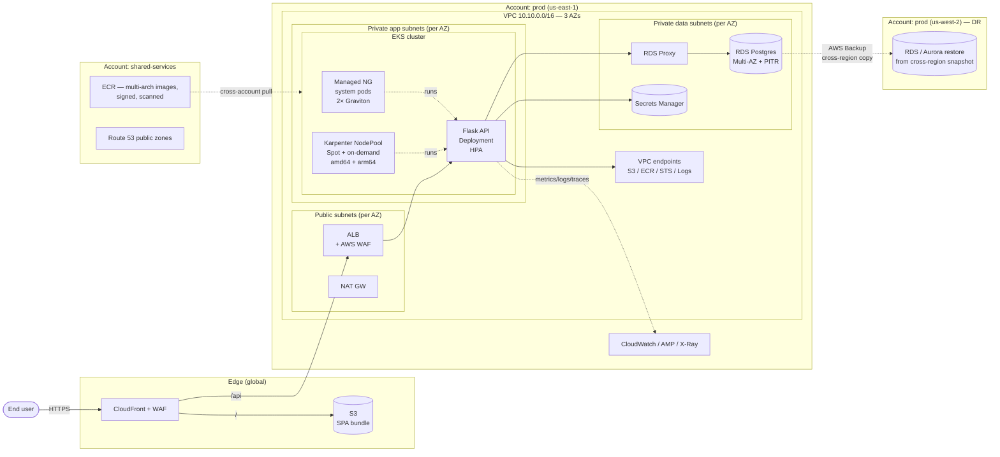
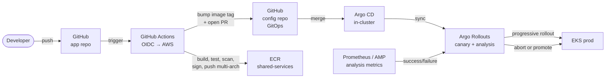

# Architecture Design — Innovate Inc.

Cloud architecture proposal for a Python/Flask + React + PostgreSQL web application that needs to scale from a few hundred users to millions, handles sensitive user data, and is deployed via CI/CD on managed Kubernetes.

---

## TL;DR — decisions

| Area | Decision | Why |
|---|---|---|
| **Cloud** | AWS | Mature managed services, strong compliance posture, consistent with the [Terraform POC](../terraform/) already built |
| **Accounts** | 5-account AWS Organization (management, log-archive, security, shared-services, prod) + non-prod added on day 2 | Blast radius isolation, separate audit, per-env quotas, billing clarity |
| **Identity** | AWS IAM Identity Center (SSO) federated to corporate IdP; GitHub OIDC for CI; **no long-lived IAM users** | No static credentials anywhere |
| **Network** | One VPC per environment, 3 AZs, private app + private data + small public tier | HA, reduces blast radius, NAT only where needed |
| **Edge** | CloudFront + WAF → ALB → EKS; SPA static on S3 behind CloudFront | Global cache, DDoS protection, lowest backend cost |
| **K8s** | Amazon EKS with **Karpenter** (Spot + Graviton, multi-arch) + 1 small managed NG for system pods | Same model proven in the POC; cheap, elastic, multi-arch |
| **Container build** | Multi-stage Dockerfile → distroless → multi-arch buildx → ECR Enhanced Scanning → cosign signing → admission verify | Supply-chain security, arch flexibility |
| **CI/CD** | GitHub Actions (build/test/push) + Argo CD in-cluster (GitOps deploy) + Argo Rollouts (canary) | Pull-based deploy, no cluster creds in CI |
| **Database** | Amazon RDS for PostgreSQL Multi-AZ → migrate to **Aurora PostgreSQL** when read-traffic demands it | Cheap to start, clear scale path |
| **Backups / DR** | Automated snapshots + PITR (35d) + AWS Backup cross-region copy to `us-west-2`; pilot-light DR | RPO ≤5 min, RTO ≤1h initially; tightens with Aurora Global Database later |
| **Region** | Primary `us-east-1`, DR `us-west-2` | Lowest service availability lag, geographic isolation |

---

## Architecture principles

Five rules that apply to every choice in this document. When two options compete, the one that respects more principles wins.

1. **Managed services first.** Buy don't build while the team is <20 engineers. Self-host only when the managed option doesn't exist or is genuinely insufficient — not because it's "interesting".
2. **No long-lived credentials, anywhere.** SSO for humans (Identity Center), OIDC for CI (GitHub → AWS), IRSA for pods. If a static access key has to exist, it's a smell — write down why.
3. **Blast radius is isolated by account, not by IAM.** Cross-environment separation lives in the AWS Org boundary. IAM policies inside an account are the second line of defence, not the first.
4. **Every choice must be additive.** What we deploy in Phase 1 must still be load-bearing in Phase 5 — no rip-and-replace migrations on the roadmap. If a decision can't survive 10× growth, it's the wrong decision.
5. **Cost-aware by default, not as a later optimization.** Spot, Graviton, VPC endpoints, distroless images, multi-arch builds — all in from day 1. Cost optimization done after launch costs 5× more than doing it right the first time.

---

## Stakeholders and concerns

Different audiences read this architecture for different reasons. The design tries to serve all four; if you're reading this as one of them, jump to the column that's yours.

| Stakeholder | Primary concerns | Where the architecture answers them |
|---|---|---|
| **Engineering** (5 devs, day-to-day) | Deploy velocity, low ops overhead, multi-arch builds, fast feedback loops, no on-call surprises | Managed EKS + Karpenter, GitOps with Argo CD, distroless images, multi-arch buildx, IRSA replacing static creds |
| **Security & Compliance** (likely future hire / fractional CISO) | SOC 2 readiness, PII protection, audit trail integrity, secret hygiene, supply-chain provenance | Org-wide CloudTrail to immutable `log-archive`, GuardDuty/Security Hub/Macie, KMS CMKs per data class, Secrets Manager + IAM DB auth, cosign + Sigstore policy-controller |
| **Finance / Founders** | Predictable spend, no surprise bills, clear cost-per-environment attribution, scaling cost stays sub-linear | Per-account billing (no tag discipline required), Spot+Graviton baseline, Aurora Serverless v2 in non-prod, Savings Plans path, monthly cost estimate in [§7 Cost optimization](#7-cost-optimization) |
| **Product / Business** | Uptime SLO, fast time-to-feature, ability to grow internationally, no architectural rewrites blocking growth | 99.9% SLO with clear path to 99.95%+, CI/CD with canary rollouts, additive 6-phase roadmap in [§8 Roadmap](#8-roadmap--from-few-hundred-users-to-millions), CloudFront global edge, Aurora Global DB option for international |

The trade-offs noted in [§9 Key trade-offs and what I'd revisit](#9-key-trade-offs-and-what-id-revisit) are the places where one stakeholder's concern was deliberately weighed against another's — usually engineering velocity vs security posture, or feature speed vs cost discipline.

---

## Scope and assumptions

- **Workload class**: standard CRUD-heavy SaaS — Flask REST API + React SPA + Postgres. No real-time/streaming/ML at this stage.
- **Data sensitivity**: contains PII / user credentials. Treat as production-grade from day 1 — encryption everywhere, audit logging, principle of least privilege.
- **Compliance target**: assume SOC 2 Type II within 12 months. Architecture must not have to be re-done for it (cross-account audit, immutable logs, KMS CMKs already baked in).
- **Team size**: small (~5 engineers). Choose managed services aggressively; minimize undifferentiated heavy lifting.
- **Budget**: no hard cap, but cost-aware choices preferred (Spot, Graviton, VPC endpoints, right-sized RDS).
- **Out of scope for this doc**: marketing site, CMS, analytics warehouse, mobile apps. Architecture leaves room for them but does not pre-build.

---

## High-level diagram (HLD)

End-to-end view of one production environment. Non-prod is structurally identical, smaller, and lives in its own AWS account.



### CI/CD pipeline (separate diagram)



---

## 1. Cloud environment structure

### Cloud provider: AWS over GCP

Both AWS and GCP can host this workload well. The choice is **AWS** for these specific reasons:

1. **Multi-account & compliance tooling is more mature.** AWS Organizations + Identity Center + Service Control Policies + Control Tower give a battle-tested path to SOC 2 / HIPAA. GCP's Resource Manager + folders + Org Policies cover the same ground but with fewer guardrails out of the box and a smaller third-party ecosystem.
2. **Security telemetry is first-party and broader.** GuardDuty, Security Hub, Macie, Inspector, IAM Access Analyzer, Config Conformance Packs — all native, integrated, and aggregable across the org. GCP's Security Command Center is comparable but the premium tier is pricier and has fewer 3rd-party integrations.
3. **The team already has an AWS POC.** [terraform/](../terraform/) is built on EKS + Karpenter + IRSA + ECR. Choosing GCP means rewriting Terraform, retraining 5 engineers, and rebuilding the CI pipeline — for a delta in capability that doesn't justify the cost.
4. **IAM and KMS give finer control for sensitive data.** AWS IAM (with conditions, SCPs, permission boundaries) and KMS (with key policies, grants, per-resource CMKs) offer more knobs for compliance-heavy workloads. GCP IAM is cleaner but less expressive — fine for most apps, less so when an auditor asks about per-resource cryptographic isolation.

### Where GCP is genuinely stronger (and we accept the trade-off)

- **GKE Autopilot** is meaningfully less ops-heavy than EKS — closer to "submit a pod and forget". Workload Identity is more elegant than IRSA. For a 5-engineer team, this is a real cost. We compensate by leaning hard on managed add-ons (Karpenter, AWS LB Controller, Argo CD) so EKS day-2 effort stays minimal.
- **Networking defaults** — GCP's global VPC and simpler subnet model are easier to reason about than AWS's per-region VPC, NAT-per-AZ, and VPC endpoint zoo. We accept the verbosity in exchange for more granular control.
- **BigQuery** — best-in-class data warehouse with no AWS equivalent at the same operational simplicity. Not a factor today (Innovate has no analytics workload), but a real factor if product analytics becomes a core feature.

### Triggers to reconsider this choice

- A major customer or partner is GCP-anchored and data colocation matters.
- Product roadmap pivots toward heavy analytics or ML — BigQuery + Vertex AI become decisive.
- The team grows and a majority strongly prefers GCP-native ergonomics (Autopilot, simpler IAM).

None of these are likely in the 12-month horizon, so the choice is committed, not provisional.

### AWS account topology

**AWS Organization with Identity Center** as the access plane, organized into Organizational Units (OUs) and discrete accounts:

```
Innovate Inc. (Org root)
├── Security OU
│   ├── log-archive             — central CloudTrail/Config logs (immutable, MRAP S3)
│   └── security                — GuardDuty, Security Hub, Macie, IAM Access Analyzer (delegated admin)
├── Infrastructure OU
│   └── shared-services         — ECR, Route53 public zones, Identity Center mgmt, KMS shared CMKs, Transit Gateway
├── Workloads OU
│   ├── prod                    — production EKS, RDS, customer data
│   └── non-prod                — dev + staging EKS, RDS dev (same VPC layout, smaller)
├── Sandbox OU
│   └── sandbox-<engineer>      — per-engineer scratch accounts (optional, day 2)
└── management                  — Org root, billing, AWS Organizations console only — NO workloads
```

### Why this layout

- **Blast radius**: a compromised workload in `non-prod` cannot reach `prod` IAM, KMS keys, or data. Regulators expect this separation.
- **Audit isolation**: `log-archive` is the only place where CloudTrail and Config logs land; even root in `prod` cannot delete them. This is the single hardest control to retrofit, so it goes in day 1.
- **Billing clarity**: per-account cost reporting (CUR) maps directly to environments without tag discipline. Easy to answer "how much does prod cost?".
- **Quota separation**: hitting an EC2 quota in non-prod doesn't starve prod.
- **Day-2 growth**: adding `staging-eu`, `prod-eu`, or per-customer accounts becomes mechanical (Account Factory / Control Tower).

### Access model

- **Humans**: Identity Center federated to the corporate IdP (Google Workspace / Okta). Each engineer assumes a role into the right account via SSO; permission sets scope what they can do (e.g. `EKSDeveloper` in non-prod is admin, in prod is read-only).
- **CI/CD**: GitHub Actions uses OIDC trust to assume a deployment role in the target account. **No long-lived access keys ever stored in GitHub.**
- **Service-to-service**: IAM Roles for Service Accounts (IRSA) inside EKS. Pods get scoped credentials via the cluster's OIDC provider — no node-level AWS access leaks to apps.
- **Service Control Policies (SCPs)** at the OU level enforce non-negotiable rules: deny disabling CloudTrail, deny IAM user creation, deny regions outside `us-east-1`/`us-west-2`, require encryption on S3 PutBucket, etc.

---

## 2. Network design

### VPC topology (per environment, per region)

| CIDR | Purpose |
|---|---|
| `10.10.0.0/16` | prod, us-east-1 |
| `10.20.0.0/16` | prod, us-west-2 (DR) |
| `10.30.0.0/16` | non-prod, us-east-1 |
| `10.40.0.0/16` | shared-services, us-east-1 |

Disjoint ranges so accounts can later be peered or attached to a Transit Gateway without re-addressing.

Within each VPC, three AZs (`us-east-1a/b/c`) and three subnet tiers per AZ:

```
┌──────────────────────────────────────────────────────────────────────┐
│  VPC  10.10.0.0/16  —  3 AZs  (1a, 1b, 1c)                           │
│                                                                      │
│  Public         /24 per AZ    ALB, NAT GW                            │
│  Private app    /22 per AZ    EKS nodes, Karpenter-launched          │
│  Private data   /24 per AZ    RDS, ElastiCache, RDS Proxy            │
└──────────────────────────────────────────────────────────────────────┘
```

- **Public**: only ALB + NAT GW. No EC2, no DBs. Internet Gateway attached.
- **Private app**: large (`/22` ≈ 1024 IPs) so Karpenter has room to burst; EKS pods get IPs from here via VPC CNI.
- **Private data**: small, RDS-only. DB security group only accepts traffic from app-tier SG, on port 5432.
- **NAT**: one per AZ in prod (HA + lower per-AZ data charges); single NAT in non-prod (cost).
- **VPC endpoints (interface + gateway)**: S3, ECR (api+dkr), STS, CloudWatch Logs, Secrets Manager, KMS. Cuts NAT egress costs and keeps traffic on the AWS backbone.
- **Tagging for EKS**: `kubernetes.io/role/internal-elb` on private subnets, `kubernetes.io/role/elb` on public. AWS Load Balancer Controller relies on these.

### Network security

- **Edge**: CloudFront sits in front of everything. AWS WAF attached at CloudFront (managed rule sets — SQLi, XSS, AWS-Common, AWS-Bot-Control). Shield Standard is on by default; Shield Advanced for prod when traffic justifies it (≥$3k/mo, but adds DDoS response team and cost protection).
- **ALB**: WAF re-attached at the ALB for defence in depth (in case someone bypasses CloudFront with the origin DNS).
- **Security groups (zero-trust between tiers)**:
  - `sg-alb` ← `0.0.0.0/0` :443 (only from CloudFront prefix list in prod, optionally)
  - `sg-app` ← `sg-alb` :8080
  - `sg-rds` ← `sg-app` :5432  *(this is the only path into the DB)*
- **Network policies inside the cluster**: Cilium (or Calico) enforces namespace-level pod isolation. The `auth` namespace can talk to `database`, but `marketing` namespace cannot.
- **Egress**: in non-prod, plain NAT. In prod, optional egress filtering (AWS Network Firewall) to allow-list outbound destinations once traffic patterns stabilize.
- **No public IPs on workload nodes.** EKS nodes live in private subnets. SSH is gone — use SSM Session Manager, no bastion. (The Task 1 POC uses an OpenVPN bastion to demonstrate the cluster privately; in production we replace it with SSM-only.)
- **DNS**: Route 53 public zones in `shared-services`; private zones in each workload account, peered via shared VPC association.

---

## 3. Compute platform — EKS

### Why EKS over alternatives

| Option | Verdict |
|---|---|
| EKS | ✅ Chosen — managed control plane, IRSA, OIDC, mature ecosystem, portable |
| ECS Fargate | Simpler, but Innovate explicitly wants Kubernetes; loses ecosystem (Helm, Argo, OPA, service mesh) |
| App Runner / Elastic Beanstalk | Too opaque for a SaaS that will grow; ceiling reached fast |
| Self-managed K8s (kops/kubeadm) | Wrong tradeoff for a 5-engineer team. Buy don't build |

### Cluster topology

```
EKS cluster (latest minor, e.g. 1.32)
│
├── Managed Node Group "system" (always on)
│   ├── 2× t4g.medium (Graviton arm64), Multi-AZ
│   ├── Hosts: Karpenter controller, CoreDNS, kube-proxy, AWS LB Controller,
│   │          metrics-server, Argo CD, ExternalDNS, cert-manager
│   └── Tainted so app workloads don't co-tenant
│
└── Karpenter NodePools (elastic, Spot-first)
    ├── "general" — c/m/r families, 2-16 vCPU, amd64+arm64, Spot+on-demand fallback
    └── "batch"   — burstable, Spot-only, taint=batch (background jobs, cron)
```

The system NG hosts critical add-ons that *must* run before Karpenter can — bootstrapping order matters. Everything else (the Flask API, workers, future services) runs on Karpenter-launched nodes.

This is the **same pattern proven in the [Terraform POC](../terraform/)** — the production cluster is the POC, hardened.

### Scaling

- **Pod autoscaling**: HPA on CPU + custom metrics (request rate, P95 latency, queue depth) via Prometheus Adapter.
- **Node autoscaling**: Karpenter, not Cluster Autoscaler. Karpenter provisions the cheapest instance type that satisfies pending pod requirements; consolidates underutilized nodes; respects PodDisruptionBudgets.
- **Architecture choice**: NodePools allow *both* `amd64` and `arm64`; pods that don't pin via `nodeSelector` get whichever is cheaper at the moment (almost always Graviton). The same multi-arch model documented in [terraform/README.md](../terraform/README.md) applies.
- **Capacity strategy**: Spot first (60-90% cheaper); fall back to on-demand for `karpenter.sh/capacity-type: on-demand` pods or when Spot is unavailable.
- **Headroom**: a low-priority "overprovisioning" pod with PriorityClass keeps a small amount of warm capacity so scale-up is instant; gets evicted when a real workload arrives. Optional, only when scale-up latency hurts.

### Resource allocation and tenancy

- **Namespaces** map to teams / domains: `api`, `worker`, `auth`, `payments`, etc.
- **ResourceQuota** per namespace caps total CPU/memory the team can consume.
- **LimitRange** sets default `requests` / `limits` so no pod ships without them.
- **PriorityClass**: `system-critical` > `prod-workload` > `batch`. Karpenter respects priorities during evictions.
- **PodDisruptionBudget** for every prod deployment (`minAvailable: 1` minimum). Karpenter consolidation honors PDB.
- **Topology spread constraints**: pods spread across AZs so an AZ failure doesn't take the API down.

### Containerization, registry, deployment

- **Build**: multi-stage Dockerfile, distroless base (`gcr.io/distroless/python3-debian12` for Flask). No shell, no package manager, attack surface is minimal.
- **Multi-arch**: `docker buildx build --platform linux/amd64,linux/arm64` produces a single manifest list. Karpenter then picks whichever arch is cheaper without anyone touching YAML.
- **Registry**: Amazon ECR private repos in the `shared-services` account, replicated to `us-west-2` for DR. Cross-account pull policy lets `prod` and `non-prod` accounts pull without copying images.
- **Image scanning**: ECR Enhanced Scanning (Inspector v2) — SBOM-based, continuous. CI fails the build on `Critical` CVEs.
- **Supply chain**:
  - SBOM generated by `syft` and attached to the image.
  - Image **signed by `cosign`** (keyless, GitHub OIDC → Sigstore Fulcio). No long-lived signing keys.
  - **Sigstore policy-controller** admission webhook in EKS verifies the signature before allowing the pod to start. Unsigned image → admission denied.
- **Deployment (GitOps)**:
  1. App repo (`innovate/api`): GitHub Actions runs tests, builds image, pushes to ECR with tag `<git-sha>`.
  2. Same workflow opens a PR against the **GitOps config repo** (`innovate/cluster-state`) bumping the image tag in `non-prod/api/values.yaml`.
  3. Argo CD running inside each cluster watches its assigned path in the config repo, syncs changes.
  4. **Argo Rollouts** does canary: 10% → analyze Prometheus metrics (error rate, P95 latency) → 25% → 50% → 100%. Auto-rollback on metric breach.
  5. Promotion to prod = a PR that copies the same tag from `non-prod/` to `prod/`. Reviewed and merged by a human; Argo picks it up.

  Pull-based: cluster credentials never leave the cluster, the CI account has no `kubectl` permissions.

---

## 4. Database — PostgreSQL

### Decision

Start with **Amazon RDS for PostgreSQL Multi-AZ**; migrate to **Aurora PostgreSQL** when read-traffic or HA requirements demand it.

| Stage | Service | When to switch |
|---|---|---|
| Day 1 (hundreds of users) | RDS Postgres `db.t4g.medium`, Multi-AZ | — |
| Growth (10k–100k users) | RDS Postgres `db.r7g.large`+, Multi-AZ + read replica | When P95 query latency degrades or replica lag matters for analytics |
| Scale (millions) | **Aurora PostgreSQL** (Multi-AZ, up to 15 read replicas, ~30s failover, instant storage scaling, Aurora Global DB for cross-region) | When you need >1 read replica, sub-minute failover, or cross-region active-active reads |

### Why this progression instead of "Aurora from day 1"

- Aurora is ~20-30% more expensive at small scale; for hundreds of users, RDS gives the same SLA at lower cost.
- The migration RDS → Aurora is a documented snapshot path (or DMS for zero-downtime); not a rewrite.
- Application code is identical (same Postgres protocol). No lock-in penalty.

Innovate gets cheap-now and clear-path-later instead of either over-engineering or painting into a corner.

### High availability

- **Multi-AZ from day 1** — synchronous standby in another AZ. Failover is automatic, ~60-120s for RDS, ~30s for Aurora.
- **RDS Proxy** in front of the database. Two reasons:
  1. Connection pooling — Flask + SQLAlchemy can otherwise exhaust Postgres `max_connections` under HPA scale-up.
  2. **Transparent failover** — apps reconnect to the proxy endpoint, which switches to the new primary without app-side retry logic.
- Read traffic (analytics, reports) routed to read replicas via a separate proxy endpoint or app-level routing.

### Backups

- **Automated daily snapshots**, retention `35 days` (RDS max).
- **Point-in-time recovery (PITR)** enabled — can recover to any second in the retention window.
- **AWS Backup** vault with a separate KMS CMK and **cross-region copy to `us-west-2`**. Retention 90 days hot + 7 years cold (Glacier) for compliance.
- Vault Lock (compliance mode) prevents anyone — including root in `prod` — from deleting backups before retention expires.

### Disaster recovery

- **RPO ≤5 min, RTO ≤1h** initially:
  - Cross-region snapshot copy every 15 min (continuous via AWS Backup).
  - DR region (`us-west-2`) keeps VPC, subnets, security groups, IAM, KMS keys provisioned ("pilot light"). DB instance is **not running** — restored from snapshot only when failover is invoked.
  - Restore via documented runbook + Terraform module; tested quarterly via game-day exercise.
- **Tightened later** with Aurora Global Database: RPO <1s (storage-level replication), RTO <1 min (promote secondary). Worth the cost when the business says minutes of data loss = unacceptable.

### Database security

- **Private subnets only** — no public endpoint. App connects via RDS Proxy in same VPC.
- **Encryption at rest** with KMS CMK (separate key per environment, automatic rotation enabled).
- **TLS in transit** required (`rds.force_ssl = 1` parameter group setting). App rejects non-TLS connections.
- **IAM database authentication** for app pods: pod's IRSA role generates short-lived (15-min) RDS auth tokens; no static DB passwords in app config. The `postgres` superuser stays in Secrets Manager for break-glass / migrations only.
- **Secrets Manager** for the few static credentials that remain (e.g. migrations user). Automatic rotation every 30 days via Lambda.
- **Audit logging**: `pgaudit` extension enabled, logs streamed to CloudWatch Logs with retention.
- **Network isolation**: SG only accepts `:5432` from app-tier SG. Nothing else, ever.

---

## 5. Security and compliance (cross-cutting)

The architecture is designed so SOC 2 Type II is achievable without re-architecting:

- **Identity**: SSO + IAM Roles only. Zero IAM users, zero long-lived keys. Enforced by SCP.
- **Audit trail**: org-wide CloudTrail → `log-archive` account → S3 with Object Lock + cross-region replication. Cannot be tampered with by any workload account.
- **Detection**: GuardDuty (org-wide, including S3 + EKS protection), Security Hub (CIS benchmark conformance), Macie (S3 PII scanning), IAM Access Analyzer (find shared resources).
- **Configuration drift**: AWS Config + Conformance Pack for CIS AWS Benchmark. Auto-remediation for high-severity findings via SSM Automation runbooks.
- **Secrets**: Secrets Manager (DB creds, API tokens). External Secrets Operator in EKS pulls them into namespaces — no secrets in Git, no secrets in `kubectl describe`.
- **Encryption keys**: per-data-class KMS CMKs (DB, S3, Backups). Customer-managed (CMK) not AWS-managed, so we control key policies and rotation.
- **Runtime threat detection**: GuardDuty EKS Runtime Monitoring + (optionally) Falco for syscall-level alerting.
- **Vulnerability management**: SCA in CI (`pip-audit` for Python, `npm audit` for React), container scan (ECR + Inspector), runtime scan (Inspector continuously assesses running EC2 + ECR images), dependency PRs auto-opened by Dependabot.
- **Network**: WAF managed rule sets, Shield Standard (Shield Advanced for prod when justified).
- **Data minimization**: only collect what's needed; rotate logs aggressively; lifecycle S3 access logs to Glacier after 30 days.

---

## 6. Observability

| Signal | Tool | Notes |
|---|---|---|
| Metrics | Amazon Managed Prometheus + Managed Grafana | Long-term storage, no Prometheus to babysit |
| Logs | Fluent Bit → CloudWatch Logs (or → S3 for long-term) | Structured JSON; PII scrubbed at app layer |
| Traces | AWS X-Ray (or OpenTelemetry → AMP) | Trace through CloudFront → ALB → API → DB |
| Synthetics | CloudWatch Synthetics | Canaries hitting `/health` from multiple regions |
| Alerts | CloudWatch Alarms → SNS → PagerDuty | Slack mirror for awareness; PagerDuty for action |

SLO: 99.9% API availability initially (≈43 min/month downtime), tightened as Aurora and active-active DR come online.

---

## 7. Cost optimization

The biggest levers, in order of ROI:

1. **Spot via Karpenter** — 60-90% off compute. Already in the POC; production-ready when combined with PodDisruptionBudgets and Argo Rollouts (slow scale-down).
2. **Graviton everywhere possible** — ~20% better price/performance vs x86 for typical Python/Node workloads. Multi-arch build means no app changes.
3. **VPC endpoints (S3, ECR, STS, Logs)** — eliminates per-GB NAT charges for AWS-internal traffic. Pays for itself within weeks at any meaningful scale.
4. **Aurora Serverless v2** for non-prod RDS — scales to near-zero at night and weekends. Not appropriate for prod (latency at scale-up), but ideal for dev/staging.
5. **Savings Plans** once the steady-state CPU footprint is predictable (3-6 months in). 1-year Compute Savings Plan typically yields 30-40% off on-demand.
6. **S3 lifecycle** — CloudTrail logs to Glacier after 90 days; backups to Deep Archive after 1 year.
7. **Right-size with metrics** — CloudWatch + Compute Optimizer recommendations, monthly review.

Approximate steady-state monthly cost at "few thousand DAU" (rough order-of-magnitude, not a quote):
- EKS control plane: $73/cluster × 2 (prod + non-prod) = $146
- Karpenter Spot nodes: $200-400 (mostly r7g/c7g, varying Spot prices)
- RDS Multi-AZ `db.t4g.medium`: ~$120 + storage
- ALB + NAT: ~$60
- CloudFront + WAF: usage-based, low at small scale
- Logs/metrics: ~$50

Probably ~$700-900/month for the entire two-environment setup with sensible use. Scales sub-linearly with traffic thanks to Spot + Graviton.

---

## 8. Roadmap — from "few hundred users" to "millions"

| Phase | Trigger | Changes |
|---|---|---|
| **0. POC** (now) | — | Single-account EKS POC ([terraform/](../terraform/)). Proves Karpenter, multi-arch, Spot, ALB ingress. |
| **1. Foundation** | Beta launch | Org structure, 5 accounts, Identity Center, log-archive, GuardDuty/Security Hub, GitHub OIDC, ECR in shared-services. |
| **2. Production launch** | First paying users | Prod EKS + RDS Multi-AZ + RDS Proxy, CloudFront + WAF, Argo CD + Rollouts, full CI/CD, on-call rotation, SLOs defined. |
| **3. Growth** | ~10k DAU, P95 latency creeps | Read replica, AMP+Grafana, X-Ray, capacity right-sizing, Savings Plans. Add staging account if not already. |
| **4. Scale** | ~100k+ DAU or HA SLAs tighten | Migrate RDS → Aurora PostgreSQL. Network Firewall for egress filtering. Shield Advanced. |
| **5. Global** | International users / strict RPO | Aurora Global Database to second region. CloudFront origin failover. Active-active in two regions. |
| **6. Multi-tenant** | Enterprise customers want isolation | Optional per-customer EKS namespace or per-customer account. Tenant-scoped IAM and KMS. |

Each phase is **additive** — nothing built earlier needs to be torn down. That's the test of whether the day-1 design was right.

---

## 9. Key trade-offs and what I'd revisit

- **Argo CD vs Flux** — picked Argo for the UI and Rollouts integration. Flux is fine, slightly lighter, no UI. Either works.
- **EKS vs GKE** — chose AWS for IAM/KMS/Org maturity and consistency with the POC. GKE has slightly nicer K8s defaults (Autopilot, Workload Identity), but the rest of AWS is harder to leave once you're committed; staying on AWS top-to-bottom is cleaner.
- **CloudFront everywhere** — adds a hop for the API. The DDoS protection, edge caching, and origin isolation make it worth it. Bypass-able via direct ALB DNS unless we lock the ALB to CloudFront prefix list (recommended).
- **Service mesh deferred** — Istio/Linkerd not in v1. Adds operational weight; benefits (mTLS, traffic shaping) are achievable with VPC SGs + ALB + Argo Rollouts initially. Add when there are >10 services or strict zero-trust requirements.
- **Network Firewall deferred** — same logic. Egress is allow-by-default in v1; tightened once outbound traffic patterns are stable.
- **Single region in v1** — `us-east-1` only, with DR in `us-west-2`. Going active-active in two regions doubles complexity; do it when business value demands it (Phase 5).

---

## Open questions for Innovate Inc.

Before turning this into Terraform, the following need answers:

1. **Compliance target** — confirmed SOC 2? Anything else (HIPAA, PCI-DSS)? Affects log retention, encryption controls, and account separation.
2. **User geography** — US-only initially, or global from day 1? Affects CloudFront price class and DR region choice.
3. **RPO/RTO commitment** — what's the business-acceptable data-loss window and downtime? Drives Aurora Global vs RDS+snapshot choice.
4. **Budget envelope** — there's a 5x cost difference between "lean" (this design) and "enterprise" (Aurora Global + Shield Advanced + Network Firewall + active-active). What's the ceiling?
5. **On-call posture** — does Innovate have on-call engineers, or do we lean harder on managed services and slow-rollout safety to compensate?

The architecture above is the answer assuming "SOC 2, US-first, RPO 5 min / RTO 1h, lean budget, 5-engineer team". Different answers shift the choices but not the structure.
